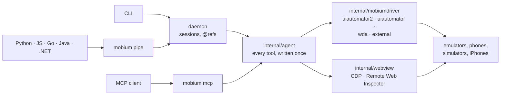

# Mobium

*Mutatis mutandis.*

**Native app automation for AI agents and humans.** Android emulators, Android
phones, iOS simulators and iPhones, driven through one tool layer from a single
Go binary with no runtime dependencies.

```sh
mobium launch com.example.shop && mobium map && mobium tap @e5 && mobium map
```

Mobium drives native mobile apps the way [Vibium](https://github.com/VibiumDev/vibium)
drives browsers: a `map` → `@ref` → act loop that an agent can follow without
learning a new model. It is Vibium's architecture with the browser swapped for
a device.

**What it is for:** letting a coding agent check its own work on mobile. An
agent that changed a login screen should be able to open the app, read what is
actually on screen, tap through the flow and look at the result — without a
person driving an emulator for it. People get the same commands.

- [Quick start](#quick-start)
- [How it works](#how-it-works)
- [Platforms](#platforms)
- [Hybrid apps and WebViews](#hybrid-apps-and-webviews)
- [Front doors](#front-doors)
- [Drivers for other platforms](#drivers-for-other-platforms)
- [Documentation](#documentation)
- [License](#license)

## Quick start

Requirements:

- **Go 1.24+**, to install it — prebuilt binaries arrive with the first
  release ([SETUP.md](docs/SETUP.md#installing-a-release))
- **Android:** platform-tools on `PATH` (or `ANDROID_HOME`, or
  `MOBIUM_ADB_PATH`), and an emulator or a phone with USB debugging on
- **iOS:** full Xcode and a booted simulator — or an iPhone on a cable, with
  an Apple ID (a free one works) added to Xcode

```sh
go install github.com/mobiumdev/mobium/cmd/mobium@latest
mobium doctor       # checks the environment; needs no device and no daemon
```

```
$ mobium devices
emulator-5554    device     (emulator, model: sdk_gphone64_arm64)

$ mobium map
@e1 Navigate up (button)
@e2 Email address (input)
@e3 password (password)
@e4 Remember me (checkbox, unchecked)
@e5 Sign In (button)
@e6 Forgot password? (link)

$ mobium type @e2 "someone@example.com"
$ mobium tap @e5
tapped @e5 at (540, 930)
```

**New here? [docs/quickstart](docs/quickstart/README.md)** walks from nothing
to a script that starts a session, launches an app, taps, screenshots and
quits — for the command line and for each client, on Android and iOS, with
the output and screenshots of it running. **Contributing?**
[docs/DEVELOPMENT.md](docs/DEVELOPMENT.md) goes from a fresh clone to a change
that passes CI.

[docs/SETUP.md](docs/SETUP.md) covers emulators, Android phones over USB and
Wi-Fi, iOS simulators and iPhones, and the setup traps whose error messages
name the wrong cause. `mobium doctor` checks the same list and names the fix.

## How it works

### Refs

`mobium map` snapshots the accessibility hierarchy, keeps the nodes a person
could act on, and gives each one the most durable locator that identifies it
uniquely — a resource-id if there is one, then an accessibility label, then
visible text, and a sibling path only as a last resort.

`mobium tap @e5` **re-snapshots and re-resolves** that locator before touching
anything. It never replays the coordinates from the map, because the screen
moves between commands and a tap at a stale point fails silently. A locator
that has become ambiguous is refused rather than guessed:

```
$ mobium tap text=Continue
error: text=Continue matches 2 elements — narrow it with role= or use a @ref from `mobium map`
```

### One locator vocabulary

The same locator means the same thing on both platforms, compiled per
platform:

| Locator | Android | iOS |
| --- | --- | --- |
| `text=Sign In` | `text` | label / value |
| `label=Email` | `content-desc` | accessibility label |
| `testid=submit` | `resource-id` | `accessibilityIdentifier` |
| `role=button` | `android.widget.Button` and kin | `XCUIElementTypeButton` |

Coordinates are device pixels on both platforms, so a point read off a
screenshot can be tapped directly.

### Actions wait, and refuse what they cannot do

Before acting, every action waits for its target to exist, be in view, stop
moving and be enabled, and scrolls to it if it is off screen. It refuses —
rather than taps — a target under a dialog or the keyboard, and `type` refuses
what is certainly not a text field. When the app itself has drawn a control
over the target, a tap aims at a clear part of it, waits for the cover to go,
or refuses and names the cover; anything else drawn over the point is
reported in the result. Inside a WebView the page itself is asked, with
Vibium's checks: the element is scrolled into view, and a tap waits for it to
be visible, enabled, still and not covered — the page's own hit test says
what is on top — and otherwise refuses with the check that failed. `type` there fills a field the way Vibium's
fill does: only a field that can take text, confirmed by reading it back, a
password never echoed. `wait` blocks for an element to appear,
disappear or read a certain way, so no flow needs a sleep.

A backend that cannot do something correctly says so and names the fix,
instead of approximating it. `adb shell input text` mangles quotes and
non-ASCII, so the zero-install backend declines text entry rather than typing
the wrong string.

### What it covers

| | |
| --- | --- |
| Reading | `map`, `text`, `find`, `screenshot`, the raw `source` with passwords hidden, WebView contexts |
| Acting | tap, double tap, type, swipe, long press, drag and drop, two-finger zoom and rotate; `check`/`uncheck` reach a state and confirm it |
| Waiting | `wait` for appear, disappear, text, enabled or disabled |
| Apps | launch, terminate, install, uninstall, list, clear data, open a URL or deep link, foreground app, any app's state, backgrounding and resuming |
| Device state | permissions, appearance, accessibility settings for the session (reduce motion, bold text, contrast, text size and more; a simulator and Android), orientation, per-app language, hardware buttons, screen lock, simulated calls and messages, notifications, timezone, clipboard, geolocation and routes |
| Dialogs | `alert` reads, answers and types into a system or app dialog; `dialogs` declares answers for one that gets in an action's way |
| Diagnostics | device logs, crash reports and ANRs, screen recording, `doctor` |
| Batches | `batch` runs a known sequence of calls in one, each checked before the first runs, stopping at the first failure |

[docs/API.md](docs/API.md) lists every tool and which front door reaches it,
and [docs/FLAGS.md](docs/FLAGS.md) every argument. Both are generated, and the
build fails if either is stale. Add `--json` to any command for its structured
answer.

**Where the platforms differ, the answer says which question it answered.**
Android reads a mock location back and confirms it; iOS's `simctl` has no
`get`, so there the answer is that the request was accepted. iOS reads the
clipboard; Android refuses the read, because since Android 10 only a focused
app may, and reporting "empty" would be a different and usually false claim.

## Platforms

Verified on devices, not only compiled: a Pixel 7 emulator on Android 15 and
Android 17, a Pixel 8 Pro on Android 17, an iPhone 17 Pro simulator on iOS
26.5, and an iPhone 15 Plus on iOS 26.6.2. The end-to-end flows in
[docs/checks/](docs/checks/) each drive a real device and assert on what
happened rather than on an exit code.

| | `uiautomator2` | `uiautomator` | `wda` |
| --- | --- | --- | --- |
| platform | Android (default) | Android | iOS simulator and iPhone |
| installs on the device | two APKs, once | nothing | one runner, once |
| `map` on an emulator | 0.04s | 1.96s | — |
| type into an element | yes | no | yes |
| two fingers, drag, double tap | yes | no | yes |
| a screen that never stops moving | fine | cannot read it | fine |

**Android** uses [Appium's UiAutomator2 server](https://github.com/appium/appium-uiautomator2-server)
directly over HTTP — the same device-side server Appium uses, with no Node in
between. Pick `--driver uiautomator` when you cannot install anything on the
device; it reads through `uiautomator dump`, which waits for the screen to go
idle and so cannot read one that animates.

**iOS simulators** use Appium's prebuilt
[WebDriverAgent](https://github.com/appium/WebDriverAgent) runner, installed
with `simctl`. **A real iPhone** takes the same backend: turn on Developer
Mode and Settings > Developer > Enable UI Automation, add an Apple ID to
Xcode, and the first command builds and signs WebDriverAgent for your team.
Controls that only `simctl` has — permissions, appearance, accessibility
settings, clipboard, simulated location — are refused on a phone with the
reason.
[docs/SETUP.md](docs/SETUP.md#ios-real-device) has the steps.

**Windows is not supported yet.** Everything cross-compiles for Windows, and
the daemon transport is written but not yet verified on a Windows machine; see
[docs/WINDOWS.md](docs/WINDOWS.md).

Both device-side agents are pinned by version, verified against checksums
compiled into the binary, and refused on a mismatch.

## Hybrid apps and WebViews

A hybrid app's web content is not usable through the accessibility tree, so
Mobium attaches to the WebView, and switching context changes what `map` and
`tap` operate on:

```
$ mobium contexts
NATIVE_APP  (current)
WEBVIEW_com.example  — Checkout https://shop.example/cart

$ mobium context WEBVIEW_com.example
$ mobium map
@e1 Promo code (input)
@e2 Apply (button)
$ mobium tap @e2
tapped @e2 at (462, 397) in WEBVIEW_com.example
```

**Reads go over the page's debugging protocol; taps stay native.** The page is
mapped by a script, its CSS coordinates are converted to device pixels using
the WebView's on-screen frame and the page's visual viewport, and the tap is
delivered by the native driver like any other. Android WebViews speak CDP; iOS
WKWebViews speak WebKit's Remote Web Inspector
([decisions/0001](docs/decisions/0001-cdp-not-webdriver-bidi.md),
[0002](docs/decisions/0002-ios-webviews-are-reachable.md)).

A WebView is reachable only if the app opted in —
`WebView.setWebContentsDebuggingEnabled(true)` on Android, `isInspectable` on
iOS 16.4 and later. Neither can be forced from outside. Which kinds of app
Mobium drives, and why React Native needs no special support while Flutter
does, is in [docs/APP-TYPES.md](docs/APP-TYPES.md).

## Front doors

The CLI does not implement behavior. It calls the same tools an MCP client
calls, so the surfaces cannot drift:



[docs/ARCHITECTURE.md](docs/ARCHITECTURE.md) has the full picture: every
layer, the package graph, and one call traced end to end.

The daemon starts on demand, holds the `@ref` table and exits after 30 idle
minutes. `MOBIUM_SESSION=<name>` gives a run its own daemon, so two terminals
or two CI jobs on one host stay isolated — and since one daemon serves one
call at a time, runs on different devices at once should each have one; every
client takes it as a `session` option ([SETUP.md](docs/SETUP.md#parallel-runs)).

**MCP:**

```sh
claude mcp add mobium -- mobium mcp
```

**Agent skill:** [skills/mobile/SKILL.md](skills/mobile/SKILL.md) teaches the
loop, the locators, WebView contexts, and that a command reporting success is
not evidence the app did anything.

```sh
npx skills add mobiumdev/mobium --skill mobile
```

**Language clients** — Python, JavaScript, Go, Java and .NET, each covering the
whole tool surface with no dependencies:

```python
from mobium import start

with start(platform="android", app="com.example.shop") as device:   # quits when the block ends
    sign_in = device.wait_for("text=Sign in")
    device.tap(sign_in.ref)
```

```go
import mobium "github.com/mobiumdev/mobium/clients/go"

dev, err := mobium.Start(ctx, mobium.WithPlatform("ios"), mobium.WithApp("com.example.shop"))
defer dev.Quit(ctx)
el, err := dev.WaitFor(ctx, "text=Sign in", nil)
err = dev.Tap(ctx, el.Ref)
```

`start` opens the session on the device and launches the app fresh; `quit`
ends it and puts back anything it changed for the session, as Appium's new
session and quit do. On the command line they are `mobium session start` and
`mobium session end`.

Every client spawns `mobium pipe`, which forwards to the shared daemon: a
device-side server holds one session at a time, so a client with its own
session would invalidate the CLI's. The Go client is a separate module that
needs only the standard library; the Java and .NET clients write their own
JSON so a test harness forces no library version onto the app under test. See
[clients/java](clients/java/README.md) and [clients/dotnet](clients/dotnet/README.md).

## Drivers for other platforms

Anything Mobium does not drive itself — a TV, a desktop app, a platform nobody
has written yet — is a **driver**: an executable named `mobium-driver-<name>`
on your `PATH`, in any language, speaking JSON-RPC on stdio.

```sh
mobium map --driver roku
```

A driver needs three methods to be useful — `snapshot`, `screenshot` and
`tap` — and inherits locators, `@ref`s, waiting, scrolling, the CLI, MCP and
all five clients. [examples/drivers/](examples/drivers/) has the guide and a
complete driver in dependency-free Python that produces the same map as the
built-in backend; [decisions/0003](docs/decisions/0003-drivers-are-processes-not-plugins.md)
is the protocol.

## Documentation

| | |
| --- | --- |
| [docs/quickstart/](docs/quickstart/README.md) | using Mobium: install it and drive a device, from each client |
| [docs/DEVELOPMENT.md](docs/DEVELOPMENT.md) | working on Mobium: toolchains, `make ci`, device checks, pull requests |
| [docs/PHILOSOPHY.md](docs/PHILOSOPHY.md) | *mutatis mutandis*: where the motto comes from, and the one design rule |
| [docs/ARCHITECTURE.md](docs/ARCHITECTURE.md) | the layers, the package graph, and one call end to end |
| [docs/SETUP.md](docs/SETUP.md) | attaching an emulator, a phone or a simulator |
| [docs/SHUTDOWN.md](docs/SHUTDOWN.md) | stopping without orphaning a device session |
| [docs/API.md](docs/API.md) | every tool and what reaches it (generated) |
| [docs/FLAGS.md](docs/FLAGS.md) | every argument and the command that sets it (generated) |
| [docs/APP-TYPES.md](docs/APP-TYPES.md) | native, web, hybrid and cross-platform apps |
| [docs/GESTURES.md](docs/GESTURES.md) | every touch gesture and what each platform did |
| [docs/FORMFLUX.md](docs/FORMFLUX.md) | one device impersonating many screens |
| [docs/CHALLENGES.md](docs/CHALLENGES.md) | platform behaviors found while building this, and how each is handled |
| [docs/WINDOWS.md](docs/WINDOWS.md) | the state of Windows support |
| [docs/ROADMAP.md](docs/ROADMAP.md) | what is next |
| [docs/RELEASE-CHECKLIST.md](docs/RELEASE-CHECKLIST.md) | the device checks CI cannot run |
| [docs/decisions/](docs/decisions/) | architecture decision records |
| [docs/checks/](docs/checks/) | end-to-end scripts that drive a real device |
| [examples/drivers/](examples/drivers/) | writing a driver |
| [CONTRIBUTING.md](CONTRIBUTING.md) | building, testing and the project's rules |

Several checks drive **[MobiumApp](https://github.com/mobiumdev/mobium-app)**,
a React Native app built to be driven: each screen is a control for a case
that can go wrong, and on iOS it is the only way to reach an app's WebView,
since one that has not opted into inspection is invisible to any debugger
([decisions/0004](docs/decisions/0004-an-app-under-test-of-our-own.md)).

## License

MIT — see [LICENSE](LICENSE).

Built binaries statically link a few Go libraries under MIT, BSD and
Apache-2.0 licenses; they are listed, with their notices, in
[THIRD_PARTY_NOTICES.md](THIRD_PARTY_NOTICES.md). The two device-side agents
(UiAutomator2 server and WebDriverAgent, Apache-2.0) are not bundled: Mobium
downloads them from their upstream releases at runtime, pinned and
checksummed, and installs them on the device.
