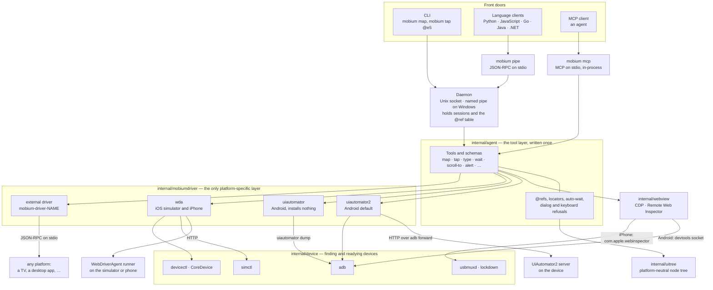
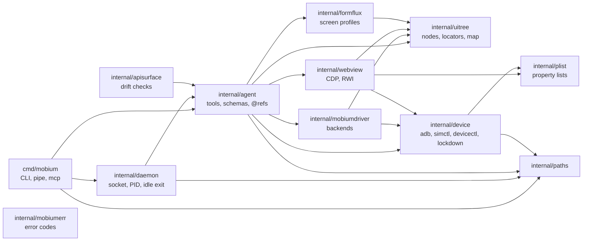
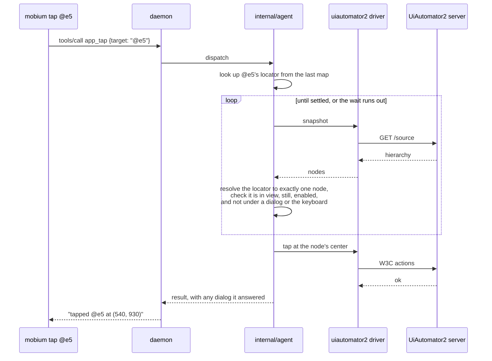

# Architecture

Mobium is one Go binary. Every way in — the CLI, an MCP client, the five
language clients — reaches the same tool layer, and the tool layer reaches
every device through one driver interface. Only the bottom layer knows which
platform it is on.

## The whole system

- **The CLI does not implement behavior.** It parses flags and calls a tool by
  name, so the CLI, MCP and every client get identical behavior.
- **Clients go through the daemon**, via `mobium pipe`, never through
  `mobium mcp`. A device-side server holds one session at a time, so a client
  with its own session would invalidate the CLI's.
- **`mobium mcp` runs the tool layer in-process**, because an MCP client already
  holds a long-lived connection of its own.
- **Reads in a WebView go over its debugging protocol; taps stay native.** The
  page's coordinates are converted to device pixels and the tap is delivered by
  the ordinary driver.
- **A third-party backend is a process**, not a Go plugin: any executable named
  `mobium-driver-<name>` on `PATH`, speaking JSON-RPC
  ([decisions/0003](decisions/0003-drivers-are-processes-not-plugins.md)).

## Packages

Arrows point from a package to the packages it imports. This is the import
graph as it stands, not an aspiration: `internal/apisurface` checks the surface
on every build, and nothing imports `cmd/`.

Every package also imports `internal/mobiumerr`, left out above for
legibility: every failure carries one of its codes, which are public API
([decisions/0005](decisions/0005-errors.md)).

| Package | Responsibility |
| --- | --- |
| `cmd/mobium` | the CLI: flags in, a tool call out. Also `pipe` and `mcp` |
| `internal/daemon` | the long-lived process that holds device sessions and refs |
| `internal/agent` | every tool: its schema, its handler, waiting, scrolling, refusals |
| `internal/uitree` | the platform-neutral hierarchy, locators, `map` and password redaction |
| `internal/mobiumdriver` | the `Driver` interface and its backends, each advertising what it can do |
| `internal/webview` | finding WebViews and speaking CDP or Remote Web Inspector to them |
| `internal/device` | adb, simctl, devicectl, usbmuxd and lockdown; installing the pinned device agents |
| `internal/formflux` | one device impersonating many screens ([FORMFLUX.md](FORMFLUX.md)) |
| `internal/plist` | the property-list codec iOS's inspector and lockdown speak |
| `internal/apisurface` | build-time checks that every tool and flag is reachable from every front door |
| `internal/paths` | socket, PID and session paths, and the OS length limit on them |
| `internal/mobiumerr` | the error codes |

## One call, end to end

`mobium tap @e5`, on Android with the default backend:

The ref is **re-resolved against a fresh snapshot** before the tap. The
coordinates from the earlier `map` are never replayed, because the screen moves
between commands. A locator that now matches nothing, or more than one thing,
is refused with a code rather than tapped.

## Where the units change

Pixels are what `map` bounds, screenshots and taps use on every platform.
WebDriverAgent reports points; the iOS driver converts them to pixels at the
driver boundary, so nothing above `internal/mobiumdriver` sees a point.
WebView coordinates are CSS pixels, converted using the WebView's on-screen
frame and the page's visual viewport.
