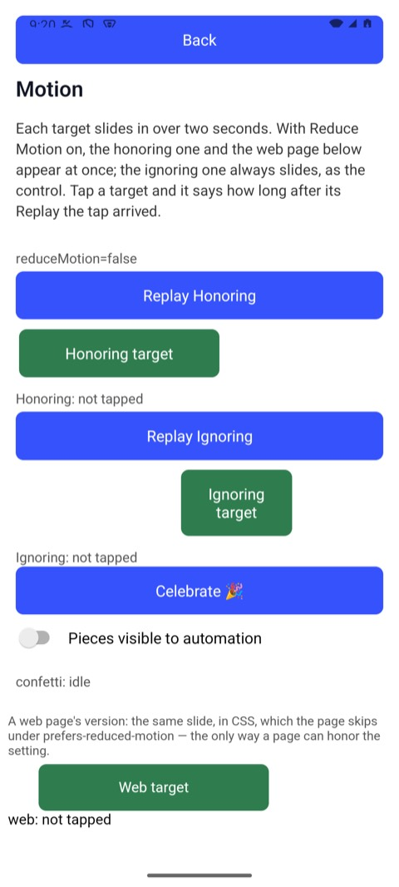
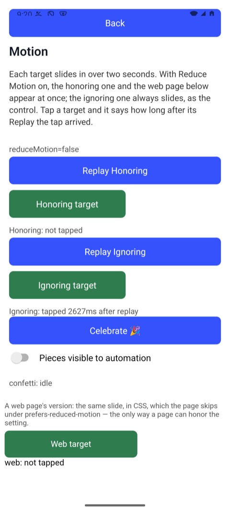
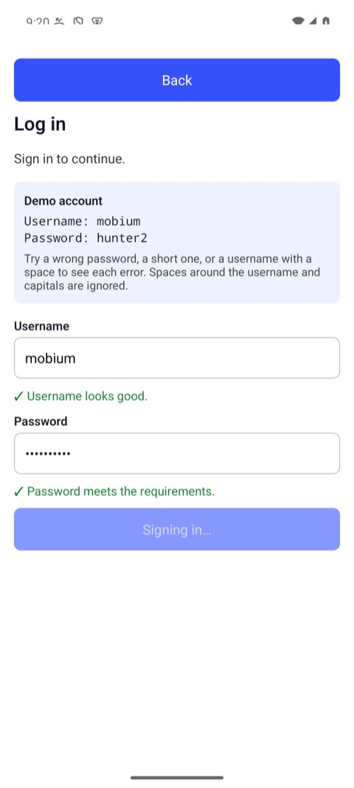
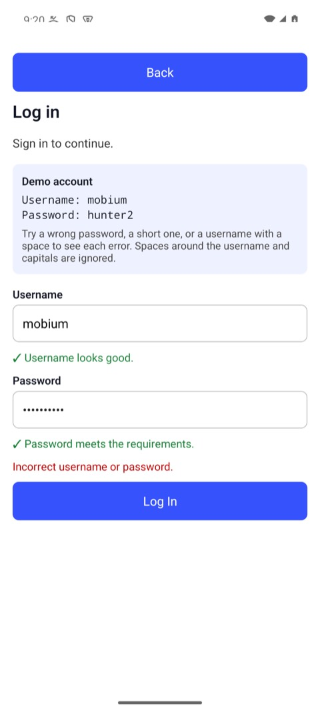
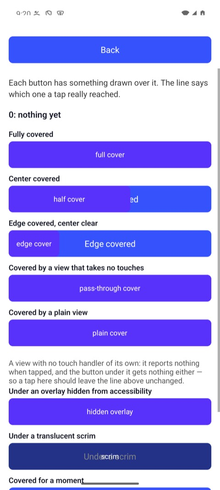
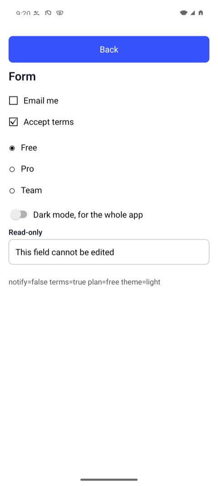

# Auto-wait: what an action waits for, and what it refuses

A tap in Mobium is not a touch at some coordinates. Before it touches
anything, an action finds its target on a fresh read of the screen and
checks that a finger could really press it. It **waits** for the checks that
time can fix, and **refuses** the ones it can't — with a reason, never with
a touch somewhere else reported as success.

This guide goes through each check on [MobiumApp](https://github.com/mobiumdev/mobium-app),
Mobium's own app under test, whose screens were built to fail each one. Every
command and every line of output below is what an Android 15 emulator printed
on 2026-09-28; the iOS simulator behaves the same, and where it differs, it
says.

Before this guide: [the quick start](../quickstart/README.md), and MobiumApp
installed (`mobiumdev/mobium-app`).

## Contents

- [The checks](#the-checks)
- [1. Waiting for something to stop moving](#1-waiting-for-something-to-stop-moving)
- [2. Waiting for a control to be enabled](#2-waiting-for-a-control-to-be-enabled)
- [3. Refusing what is covered](#3-refusing-what-is-covered)
- [4. Refusing the wrong kind of target](#4-refusing-the-wrong-kind-of-target)
- [5. Waiting on purpose: `mobium wait`](#5-waiting-on-purpose-mobium-wait)
- [6. Reading a refusal from code](#6-reading-a-refusal-from-code)
- [What it does not see](#what-it-does-not-see)

## The checks

Five checks, each with a name that a refusal carries:

| Check | What it asks | If it fails |
| --- | --- | --- |
| `visible` | is the target on the screen, not just in the hierarchy? | scrolls to it, then refuses |
| `stable` | has it stopped moving? | waits, up to 5 seconds |
| `enabled` | does it take input? | waits, up to the implicit wait of 2 seconds, then refuses |
| `receivesEvents` | would a finger reach it — no dialog, keyboard or other control over it? | waits for a transient cover (a toast), aims around one over its center, refuses one over all of it |
| `editable` | for `type` and `fill`: is it a text field? | refuses at once |

A refusal always reads `<target> failed check <check>: <reason> — <what to do>`,
and carries the check in its details, so code decides by the check, not by the
wording ([section 6](#6-reading-a-refusal-from-code)).

## 1. Waiting for something to stop moving

The Motion Demo's Replay button slides a target in over two seconds. Tap the
target the moment after Replay, with no sleep in between:

```
$ mobium tap testid=ignoringReplay
tapped testid=ignoringReplay at (540, 1315)

$ mobium tap testid=ignoringTarget
tapped testid=ignoringTarget at (316, 1472)

$ mobium text testid=ignoringResult
Ignoring: tapped 2697ms after replay
```

| Just after Replay: the target still sliding in | After the tap: it waited, and says when it arrived |
| --- | --- |
|  |  |

(These pictures are of a later run of the same two taps, which said 2627ms.)
The app's own stopwatch says the tap landed 2.7 seconds after Replay — after
the slide ended. The second `tap` waited for the target to hold still, and
touched it where it stopped, not where it was passing through. Something that
never holds still — a falling piece of confetti — is refused after five
seconds as `failed check stable`.

## 2. Waiting for a control to be enabled

The Login Demo disables Log In while it signs in. Tap it, and tap it again at
once:

```
$ mobium fill testid=username mobium
typed "mobium" into testid=username

$ mobium fill testid=password wrongpass1
typed 10 characters into testid=password, a password field — not echoed

$ mobium tap testid=loginBtn
tapped testid=loginBtn at (540, 1457)

$ mobium wait testid=loginBtn --for disabled
testid=loginBtn is disabled after 619ms — @e5 Signing in… (button)

$ mobium tap testid=loginBtn
tapped testid=loginBtn at (540, 1689)
```

| After the first tap: Log In disabled, "Signing in…" | When it comes back: the app's answer, and Log In enabled |
| --- | --- |
|  |  |

The second tap waited for "Signing in…" to end and the button to come back,
then pressed it. A tap on a disabled control does nothing, so reporting it as
done would be a lie; a control that stays disabled past the wait is refused as
`failed check enabled`. The password is never printed — only its length.

## 3. Refusing what is covered

The Obstruction Demo draws controls over its targets — a full cover, a half
cover over the center, an edge cover that leaves the center clear, views that
take no touches, an overlay hidden from accessibility, a scrim:



One is covered entirely by another button:

```
$ mobium tap testid=fullTarget
error: testid=fullTarget failed check receivesEvents: it is covered by "full cover" (button), and was for 2s — a touch there would press that instead; wait for it to go, dismiss it, or tap its own ref from app_map if it is what you meant
```

It waited two seconds in case the cover went away — a toast does — and then
refused, naming the cover, rather than pressing it. Another target is covered
only over its center:

```
$ mobium tap testid=halfTarget
tapped testid=halfTarget at (650, 975); its center is covered by "half cover", so it was touched at a clear point
```

It aimed around the cover and said so. A system dialog, an iOS sheet and the
on-screen keyboard are covers too, refused the same way, with the remedy for
each: answer the dialog, hide the keyboard.

`map` says the same before anything is tapped. A target a control covers at
every point — one a tap would be refused for — is marked with what covers it,
here on an Android emulator:

```
$ mobium map
…
@e3 Fully covered (button, covered by "full cover")
@e4 Center covered (button)
@e6 Edge covered (button)
@e9 Under a plain view (button)
@e10 Under a hidden overlay (button, covered by "hidden overlay")
@e11 Under a scrim (button, covered by "scrim")
```

The half and edge covers leave a point a tap reaches, so those targets are
not marked. Neither is the one under a plain view: nothing in the tree says
whether a plain view takes a touch or lets it through, so `map` marks only
what a tap would refuse. The structured result carries the same as
`covered`.

## 4. Refusing the wrong kind of target

`type` and `fill` go into text fields. Anything that is certainly not one is
refused before a key is sent:

```
$ mobium type testid=loginBtn hello
error: testid=loginBtn failed check editable: it is a button, not a text field — app_type types into a field; to press it, use app_tap
```

## 5. Waiting on purpose: `mobium wait`

The checks above make each action wait for its own target. For everything
else — a result to arrive, a spinner to go, a state to change — say what you
are waiting for, instead of sleeping:

```
$ mobium wait testid=loginError --for text --text "Incorrect username or password." --exact
testid=loginError says exactly "Incorrect username or password." after 1.631s — @e1 ScrollView (list)
```

It returned as soon as the text was there — 1.6 seconds here, whatever it is
on a slower device. What it hands back is the element you can act on: the
error text is not a control, so the nearest thing on screen with a ref is
named — here the list it sits in.

On the Form Demo, a wait that cannot hold says what it saw:

```
$ mobium wait testid=termsCheck --for checked --timeout 2s
error: timed out after 2.017s waiting for testid=termsCheck to become checked — it is unchecked

$ mobium check testid=termsCheck
testid=termsCheck is now checked
```



```
$ mobium wait testid=termsCheck --for checked
testid=termsCheck is checked after 12ms — @e3 Accept terms (checkbox, checked)

$ mobium wait role=radio --count 3
role=radio matches 3 on screen after 11ms

$ mobium wait testid=planFree --for checked --not --timeout 2s
error: timed out after 2.016s waiting for testid=planFree to stop being checked — it is checked
```

Every condition:

| `--for` | Waits until |
| --- | --- |
| `visible` (the default), `hidden` | it is on screen, or gone |
| `enabled`, `disabled` | it takes input, or does not |
| `checked`, `unchecked` | a checkbox, radio or switch is in that state; anything else is refused at once |
| `focused` | a field has keyboard focus |
| `text --text T` | its text contains T; with `--exact`, is T |
| `value --text T` | a field holds exactly T; `--text ""` is empty. A password field is refused — its value is never read |
| `count` (or just `--count N`) | the locator matches N elements on screen |
| any of them `--not` | the opposite |

The default timeout is 10 seconds, `--timeout` changes it, up to two minutes.
A successful wait remaps the screen, so the element it found already has a
ref: `mobium tap @e3` straight after, with no `map` in between.

## 6. Reading a refusal from code

`--json` gives the structured half of every answer. The same covered tap:

```
$ mobium --json tap testid=fullTarget
{
  "error": "testid=fullTarget failed check receivesEvents: it is covered by \"full cover\" (button), and was for 2.2s — a touch there would press that instead; wait for it to go, dismiss it, or tap its own ref from app_map if it is what you meant",
  "code": "element_not_reachable",
  "message": "testid=fullTarget failed check receivesEvents: it is covered by \"full cover\" (button), and was for 2.2s — a touch there would press that instead; wait for it to go, dismiss it, or tap its own ref from app_map if it is what you meant",
  "remedy": "dismiss what is over it, wait for it to go, or tap the cover's own ref from app_map",
  "retryable": false,
  "details": {
    "check": "receivesEvents",
    "cover": "full cover",
    "locator": "testid=fullTarget",
    "reason": "it is covered by \"full cover\" (button), and was for 2.2s"
  }
}
```

Decide by `code` — the same in every client, and the CLI's exit status (4
here) — and by `details.check`, never by the message, which is written for a
person and may change. Every client raises the code as its own exception:
`ElementNotReachableError` in Python and JavaScript,
`ElementNotReachableException` in Java and .NET, and in Go an error that
`errors.Is(err, mobium.ErrElementNotReachable)`
([the codes](cli.md#6-when-a-command-fails)).

## What it does not see

- **An overlay hidden from accessibility on iOS**, unless asked for.
  WebDriverAgent's tree does not contain it, so a tap under one lands on it —
  WebDriverAgent's own `hittable` gets it wrong too, measured. UIKit's own
  hit test does see it: `mobium hit-test <target>` asks it whether a touch
  at the point a tap would use reaches the target, and names what it would
  reach instead. It attaches a debugger to the app, about two seconds a call
  on a simulator and nine on an iPhone, where the app must be a development
  build. On a simulator, `mobium launch --hit-test <app>` loads the check
  into the app as it starts, and then every action on an element in it asks
  first, in under a millisecond, and is refused when the touch would land
  elsewhere.
- **Whether a plain view swallows a tap.** A view with no handler over the
  target looks exactly like one that lets touches through. Mobium taps and
  says a view is over the point, in the result, rather than refuse something
  that works.
- **Work the screen does not show.** A request in flight behind rows that
  look finished passes every check, and a tap lands on a row about to be
  replaced. An app that says when it is busy can be waited for:
  [gray box](graybox.md), `mobium launch --gray-box`.
- **What the app does with the tap.** A tap that reached its target is
  reported as tapped. Whether the app did the right thing is what `wait`, and
  a test, are for.
