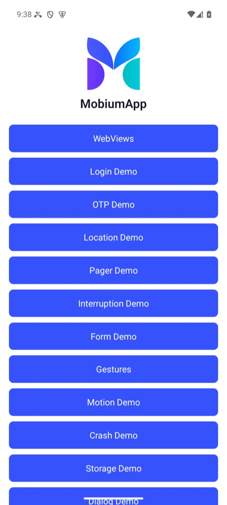
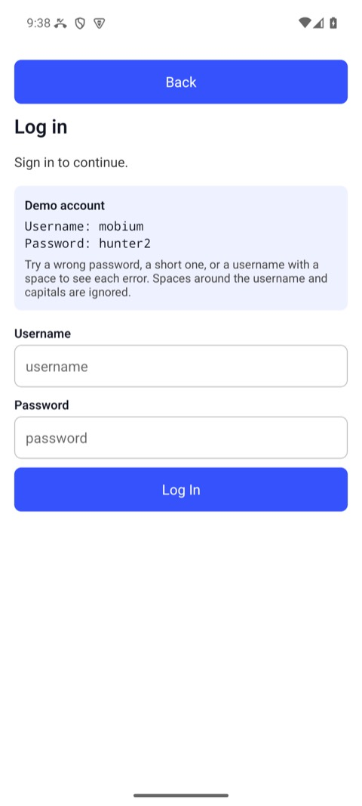

# The command line

`mobium` is one binary, and every command is one call to one of Mobium's
tools — the same tools an MCP client and the five language clients call, so
the command line cannot do something they cannot. This guide is how the
commands fit together: the loop, sessions and the daemon, the flags every
command takes, reading answers from a script, and exit statuses.

Every command and every line of output below is what `mobium` printed on
2026-09-28 against [MobiumApp](../decisions/0004-an-app-under-test-of-our-own.md)
on an Android 15 emulator. Where output is trimmed or a path shortened, it
says so. The full list of commands and what each takes is generated:
[API.md](../API.md) and [FLAGS.md](../FLAGS.md).

## Contents

- [1. Which devices](#1-which-devices)
- [2. A session](#2-a-session)
- [3. The loop: map, act, map](#3-the-loop-map-act-map)
- [4. Locators and refs](#4-locators-and-refs)
- [5. Answers for a script: `--json`](#5-answers-for-a-script---json)
- [6. When a command fails](#6-when-a-command-fails)
- [7. Several steps in one call: `batch`](#7-several-steps-in-one-call-batch)
- [8. The daemon, and running several at once](#8-the-daemon-and-running-several-at-once)
- [The flags every command takes](#the-flags-every-command-takes)

## 1. Which devices

```
$ mobium --version
mobium version 0.1.0-dev

$ mobium devices
emulator-5554                          device     (android emulator, model: sdk_gphone64_arm64)
```

(Trimmed: the Mac also listed its iOS simulators, shut down, and a phone.)
With one device running, no command needs to be told which; with several,
`--device <serial or udid>` picks one, on every command.

## 2. A session

A session is a device made ready — its automation server started — with,
optionally, an app launched fresh:

```
$ mobium session start --platform android --app dev.mobium.mobiumapp
waiting for the UiAutomator2 server to start...
session started on emulator-5554 (android, uiautomator2); dev.mobium.mobiumapp was launched fresh and is in the foreground

$ mobium session status
open: emulator-5554 (android, uiautomator2)
```

Every command after it uses that session. `session end` closes it, and puts
back anything it changed for the session — network conditions,
accessibility settings — and stops the app it launched:

```
$ mobium session end
session ended on emulator-5554; anything it changed for the session is put back; dev.mobium.mobiumapp, which the session launched, was stopped
```

A session is not required: any command opens one on first use. Starting one
says which device and app a run is about, and ending it is how a run cleans
up after itself.

## 3. The loop: map, act, map

`map` lists what on the screen can be acted on, each with a ref:

```
$ mobium map
@e1 homeList (list)
@e2 WebViews (button)
@e3 Login Demo (button)
@e4 OTP Demo (button)
@e5 Location Demo (button)
@e6 Pager Demo (button)
@e7 Interruption Demo (button)
@e8 Form Demo (button)
@e9 Gestures (button)
@e10 Motion Demo (button)
@e11 Crash Demo (button)
@e12 Storage Demo (button)
@e13 Dialog Demo (button)
```

Act on one, and map again — the screen has changed, and refs from before
belong to the screen that is gone:

```
$ mobium tap label=Login Demo
tapped label=Login Demo at (540, 814)

$ mobium map
@e1 ScrollView (list)
@e2 Back (button)
@e3 username (input)
@e4 password (password)
@e5 Log In (button)
```

| Before: `map` lists the buttons | After the tap: the fields, and `password` marked as one |
| --- | --- |
|  |  |

A password field is labeled by its id and given the role `password`; what is
typed into one is never printed, by `map` or any other command.

## 4. Locators and refs

Anything that takes a target takes either:

- **a ref** from the last `map` — `@e3` — short, and valid until the screen
  changes; or
- **a locator** — `testid=username`, `label=Login Demo`, `text=Sign in`,
  `role=button` — which survives across screens and runs, and is what a
  script or a test should use. `testid=` is the one that survives a
  translation and a redesign.

A locator that matches more than one element is refused, never guessed at;
append a role — `label=Apps,role=button` — or use a ref. Every action waits
for its target to be ready before it touches it — [auto-wait](autowait.md) is
the whole story.

## 5. Answers for a script: `--json`

Every command's answer has a text half, for a person, and a structured half,
which `--json` prints instead:

```
$ mobium fill testid=username mobium
typed "mobium" into testid=username

$ mobium --json find testid=username
{
  "context": "NATIVE_APP",
  "device": "emulator-5554",
  "elements": [
    {
      "bounds": {
        "x1": 42,
        "x2": 1038,
        "y1": 1027,
        "y2": 1153
      },
      "label": "mobium",
      "locator": {
        "exact": true,
        "kind": "testid",
        "value": "username"
      },
      "ref": "@e3",
      "role": "input"
    }
  ]
}
```

Bounds are device pixels. Read the structured half from code, never the
text, which is written for a person and may change.

## 6. When a command fails

A failure says what happened and what to do about it, and exits with a status
that says what kind of failure it was:

```
$ mobium tap testid=noSuchButton
error: no element matches testid=noSuchButton on the current screen — the screen may have changed, run app_map again
```

With `--json`, the same failure as data — its code, its remedy, whether
retrying could help:

```
$ mobium --json tap testid=noSuchButton; echo $?
{
  "error": "no element matches testid=noSuchButton on the current screen — the screen may have changed, run app_map again",
  "code": "no_such_element",
  "message": "no element matches testid=noSuchButton on the current screen — the screen may have changed, run app_map again",
  "remedy": "run app_map again, or app_scroll_to if it may be off screen",
  "retryable": false,
  "details": {
    "locator": "testid=noSuchButton"
  }
}
4
```

| Exit status | Codes | Meaning |
| --- | --- | --- |
| 0 | — | it did what was asked, and checked |
| 2 | `invalid_argument` | the command was wrong — nothing on any device could make it work |
| 3 | `no_device`, `device_not_ready`, `toolchain_missing` | no device, or one not ready: locked, a dialog up, a tool missing |
| 4 | `no_such_element`, `ambiguous_locator`, `element_not_reachable`, `no_such_context`, `no_such_alert` | the target was not there, was two things, or could not be reached |
| 5 | `unsupported` | this device or driver cannot do it — retrying will not help |
| 6 | `timeout` | it did not happen in time — the one kind worth retrying as it is |
| 7 | `not_confirmed` | the command ran and reading back says it did not take — a finding |
| 1 | anything else | read the message |

The codes are the same in every client, as exceptions, and on the MCP wire
([decisions/0005](../decisions/0005-errors.md)).

## 7. Several steps in one call: `batch`

A known sequence can go as one call — from a file, or `-` for stdin. Every
step is checked before the first runs, and it stops at the first failure,
with that step's own error:

```json
[
  {"name": "app_tap", "arguments": {"target": "label=Login Demo"}},
  {"name": "app_fill", "arguments": {"target": "testid=username", "text": "mobium"}},
  {"name": "app_fill", "arguments": {"target": "testid=password", "text": "hunter2"}},
  {"name": "app_tap", "arguments": {"target": "testid=loginBtn"}},
  {"name": "app_wait_for", "arguments": {"target": "testid=welcomeText"}}
]
```

```
$ mobium batch steps.json
1. app_tap: tapped label=Login Demo at (540, 814)
2. app_fill: typed "mobium" into testid=username
3. app_fill: typed 7 characters into testid=password, a password field — not echoed
4. app_tap: tapped testid=loginBtn at (540, 1457)
5. app_wait_for: testid=welcomeText is visible after 1.622s
```


The same steps, with assertions and a report, are a test:
[`mobium test`](test-runner.md).

## 8. The daemon, and running several at once

The first command starts a daemon in the background, which holds the device
sessions and the refs between commands, and exits after 30 idle minutes:

```
$ mobium daemon status
Daemon running (pid 4156, up 8s)
  version 0.1.0-dev
  socket  ~/.mobium/daemon/mobium.sock
```

(The home directory is shortened to `~` here and below.) One daemon serves
one call at a time. Two runs at once — two terminals, two CI jobs, two
devices — should each have their own, named by `MOBIUM_SESSION`:

```
$ MOBIUM_SESSION=ci-android mobium current
waiting for the UiAutomator2 server to start...
dev.mobium.mobiumapp

$ MOBIUM_SESSION=ci-android mobium daemon status
Daemon running (pid 4384, up 1s)
  version 0.1.0-dev
  socket  ~/.mobium/daemon/mobium-ci-android.sock
  session ci-android
```

`mobium daemon stop` stops one, ending its sessions — stop it before shutting
a device down, never after ([SHUTDOWN.md](../SHUTDOWN.md)). Keep session names
short: a name is part of a socket path, which the OS caps at about 104
bytes.

## The flags every command takes

| Flag | Does |
| --- | --- |
| `--device <serial or udid>` | which device, when more than one is running |
| `--driver <name>` | `uiautomator2` (Android's default), `uiautomator` (Android, installs nothing on the device), `wda` (iOS simulators and iPhones), or a third-party driver |
| `--json` | the structured answer instead of the text |
| `--remote <[user@]host>` | drive another machine's devices, over SSH — [the grid guide](grid.md) |
| `-v`, `--verbose` | what mobium is doing, on stderr |

`mobium <command> --help` has each command's own flags and examples, and
`mobium doctor` checks the setup — the Android and iOS tools, the devices,
the daemon — and names the fix for anything wrong.
