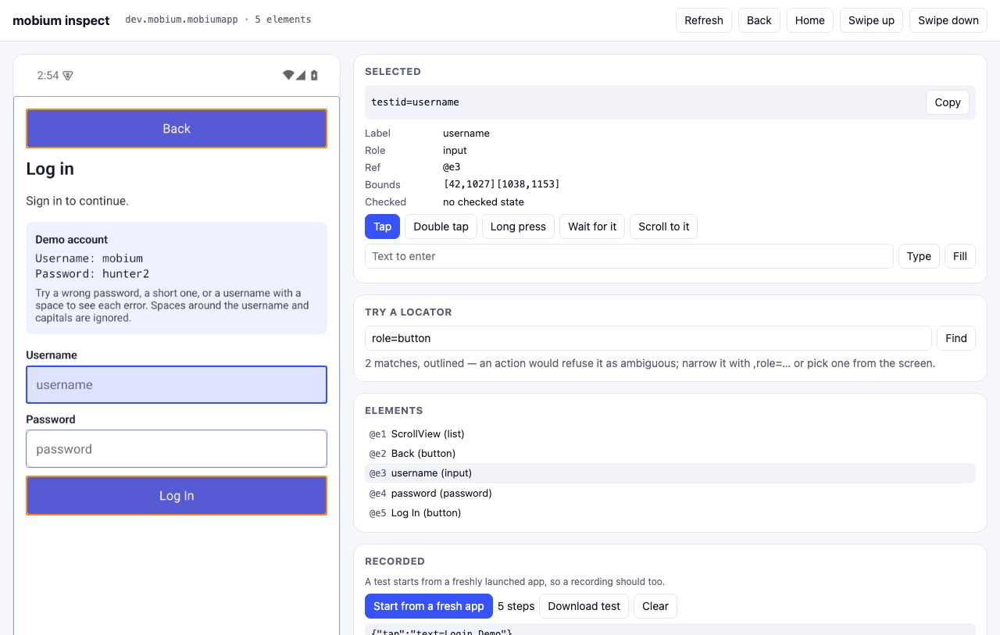

# Quick start: `mobium inspect`

A page on your own machine with the device's screen in it: every element
`map` finds outlined, the locator for the one you click, actions on it, a
place to try a locator and see what it matches — and what you do, kept as a
test `mobium test` runs.

Everything below was run on 2026-09-29 against
[MobiumApp](https://github.com/mobiumdev/mobium-app) on an
Android 15 emulator; the output is what mobium printed. Before this guide:
[the quick start](../quickstart/README.md), and MobiumApp installed.

## Contents

- [1. Start it](#1-start-it)
- [2. Find the locator for anything](#2-find-the-locator-for-anything)
- [3. Try a locator](#3-try-a-locator)
- [4. Record a test](#4-record-a-test)
- [Who can reach it](#who-can-reach-it)

## 1. Start it

```
$ mobium inspect --device emulator-5554
mobium inspect on http://127.0.0.1:47311/819d02101356fef7563223333156107f/ — Ctrl-C to stop
```

Open that URL — `--open` does it for you. The long part of it is a token: the
page answers nothing that does not carry it ([below](#who-can-reach-it)).
It calls the same tools every command does, through the same daemon, so a
terminal and the page drive one session: run `mobium tap` in a terminal and
**Refresh** shows what it did.

## 2. Find the locator for anything



Click an element on the screen, or in the list under it. The panel says what
`map` says of it — label, role, ref, bounds, checked state — and, at the top,
**the locator a test should use**: the one `map` derived as the most durable
that names it alone, `testid=username` here. The ref, `@e3`, names it on this
screen only.

The buttons under it act on it — tap, double tap, long press, check or
uncheck, wait for it, scroll to it, type or fill text — through the tools,
waiting and refusing as a command would; a refusal is in the log, with its
code. Clicking where no element is offers to tap that point. Back, Home and
the swipes act on the screen.

## 3. Try a locator

Type a locator and **Find**: every match is outlined in orange, and the page
says how many. `role=button` on the Login Demo matches two, Back and Log In —
"2 matches, outlined — an action would refuse it as ambiguous", which is
what `mobium tap role=button` would say, seen before it is said.

## 4. Record a test

A test starts from a freshly launched app, so a recording should too:
**Start from a fresh app** stops the app in front and launches it again, as
`mobium test` does before each test, and starts recording. From there, every
action is a step. Recorded on the Login Demo:

```json
{
  "app": "dev.mobium.mobiumapp",
  "description": "Recorded with mobium inspect.",
  "tests": [
    {
      "name": "recorded",
      "steps": [
        {"tap": "text=Login Demo"},
        {"fill": {"target": "testid=username", "text": "mobium"}},
        {"fill": {"target": "testid=password", "text": "hunter2"}},
        {"tap": "testid=loginBtn"},
        {"wait_for": "text=Welcome"}
      ]
    }
  ]
}
```

(Spaced for reading.) **Download test** saves it as `recorded.test.json`, in
the step shorthand and by locator, never by ref. It runs as it is:

```
$ mobium test recorded.test.json
  ok    [default · emulator-5554] recorded.test.json › recorded (8.5s)
1 passed (8.5s)
```

A recording keeps what you typed, the password included; that is the demo
account's here, and worth remembering before recording against your own.

## Who can reach it

It listens on 127.0.0.1 only, so nothing off this machine can. That is not
enough for a page that taps a device: any web page open in the same browser
can send a request to 127.0.0.1. So the inspector answers only a request
that carries the token from the URL it printed — which nothing else has —
and whose `Host` is the address it listens on, which a DNS-rebinding page's
is not. An action must be a POST, and must be one of the actions above:
the page cannot uninstall an app or run a script in a WebView by naming
the tool. On a real phone the screen is somebody's; the page shows it only to
the person who started the command, and saves nothing but the test they
download.
