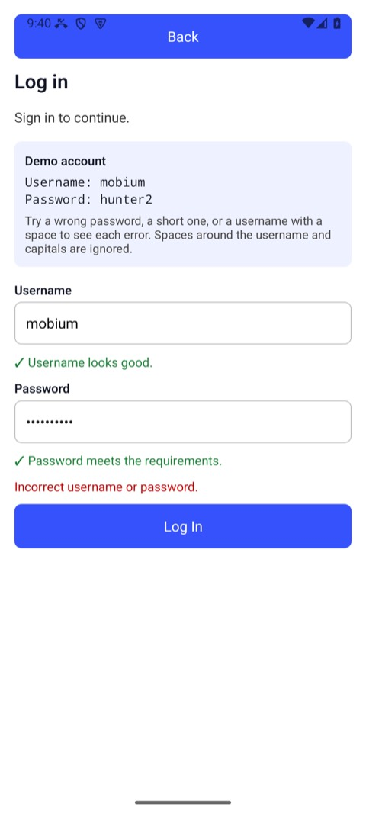

# MCP: Mobium as an agent's tools

`mobium mcp` serves every one of Mobium's tools over the Model Context
Protocol, on stdio, so an agent — Claude Code, or any MCP client — drives
devices with the same tools the command line and the language clients use.
This guide is how to connect one, what it sees, and how its answers and
failures come back.

Everything below is what ran on 2026-09-28 against [MobiumApp](https://github.com/mobiumdev/mobium-app)
on an Android 15 emulator: a Claude Code agent given only Mobium's tools, and
the raw protocol, as an MCP client speaks it. Long answers are trimmed where
they say so. The full tool list is generated: [API.md](../API.md).

## Contents

- [1. Connect it](#1-connect-it)
- [2. An agent at work](#2-an-agent-at-work)
- [3. What a client sees](#3-what-a-client-sees)
- [4. Answers: text, data and images](#4-answers-text-data-and-images)
- [5. Failures](#5-failures)
- [6. Sessions, and sharing a device](#6-sessions-and-sharing-a-device)
- [Which front door](#which-front-door)

## 1. Connect it

In Claude Code:

```sh
claude mcp add mobium -- mobium mcp
```

With more than one device, pin one — `mobium mcp --device emulator-5554` —
or let the agent pass `device` to each call. `--driver wda` makes iOS the
default.

Other MCP clients take the same server in their JSON configuration, under
`mcpServers`:

```json
{
  "mcpServers": {
    "mobium": {
      "command": "mobium",
      "args": ["mcp", "--device", "emulator-5554"]
    }
  }
}
```

That is the shape the run below used, passed to Claude Code as
`--mcp-config`; where each client keeps the file is the client's own
documentation. `command` needs mobium's full path if it is not on the
`PATH` the client starts with.

## 2. An agent at work

Claude Code, non-interactively, with Mobium's server and nothing else allowed:

```sh
claude -p "Use the mobium tools. On the Android emulator, open the app
dev.mobium.mobiumapp, go to its Login Demo, sign in with username mobium and
password wrongpass1, and tell me exactly what the app says. Keep it short." \
  --mcp-config mobium.json --strict-mcp-config --allowedTools mcp__mobium
```

The calls it made, in order, each with the structured half of its answer
(trimmed to a line):

```
app_launch   {"app": "dev.mobium.mobiumapp"}
             → {"app":"dev.mobium.mobiumapp","device":"emulator-5554"}
app_tap      {"target": "text=Login Demo"}
             → {"action":"tap","target":"text=Login Demo","x":540,"y":677}
app_find     {"locator": "role=input"}
             → {"elements":[{"ref":"@e3","label":"username","role":"input", …
app_fill     {"target": "testid=username", "text": "mobium"}
app_fill     {"target": "testid=password", "text": "wrongpass1"}
app_find     {"locator": "role=button"}
             → {"elements":[{"ref":"@e2","label":"Back","role":"button", …
app_tap      {"target": "testid=loginBtn"}
app_text     {}
app_wait_for {"target": "text=Signing in…", "condition": "hidden"}
             → {"target":"text=Signing in…","condition":"hidden","waited_ms":15}
app_text     {}
```

And its answer, in 12 turns and 23 seconds:

> The sign-in failed. The app says:
>
> **"Incorrect username or password."**
>
> Before that, both fields passed their checks: "✓ Username looks good." and
> "✓ Password meets the requirements." The screen lists the demo account's
> correct password as `hunter2`.



It found the fields by role, used the locators the answers gave it, saw
"Signing in…" and waited for it to go rather than guessing a delay, and
never saw the password it typed: a password field is never read back as
text.

## 3. What a client sees

The handshake, as sent and answered:

```
>>> {"jsonrpc": "2.0", "id": 1, "method": "initialize", "params": {"protocolVersion": "2024-11-05", "capabilities": {}, "clientInfo": {"name": "probe", "version": "1"}}}
<<< {
  "jsonrpc": "2.0",
  "id": 1,
  "result": {
    "protocolVersion": "2024-11-05",
    "capabilities": {
      "tools": {}
    },
    "serverInfo": {
      "name": "mobium",
      "version": "0.1.0-dev"
    }
  }
}
```

`tools/list` answered with 71 tools, 19 of them marked read-only. One, with
its description cut short and its schema reduced to the argument names:

```json
{
  "name": "app_tap",
  "description": "Tap an element. Give a ref from app_map (\"@e5\"), a locator (\"text=Sign In\", \"testid=submit\", \"label=Email\", \"role=button\"), or x and y in device pixels. The ele …",
  "inputSchema": {
    "type": "object",
    "properties": [
      "device",
      "double",
      "driver",
      "fingers",
      "target",
      "x",
      "y"
    ]
  },
  "annotations": {
    "readOnlyHint": false
  }
}
```

Every schema says `additionalProperties: false`, so an argument a tool does
not take is refused rather than ignored. `readOnlyHint` is on every tool:
true for the 19 that only read — `app_map`, `app_text`, `app_state` and the
like — and false for everything that can change the device.

## 4. Answers: text, data and images

Every answer has two halves: `content`, text for the model to read, and
`structuredContent`, the same answer as data for code:

```
>>> {"jsonrpc": "2.0", "id": 4, "method": "tools/call", "params": {"name": "app_map", "arguments": {}}}
<<< {
  "jsonrpc": "2.0",
  "id": 4,
  "result": {
    "content": [
      {
        "type": "text",
        "text": "@e1 homeList (list)\n@e2 WebViews (button)\n@e3 Login Demo (button)\n@e4 OTP Demo (button)\n@e5 Location Demo (button)\n@e6 Pager Demo (button)\n@e7 Interruption Demo (button)\n@e8 Form Demo (button)\n@e9 Gestures (button)\n@e10 Motion Demo (button)\n@e11 Crash Demo (button)\n@e12 Storage Demo (button)\n@e13 Dialog Demo (button)"
      }
    ],
    "structuredContent": {
      "elements": [
        {
          "ref": "@e1",
          "label": "homeList",
          "role": "list",
          "locator": {
            "kind": "testid",
            "value": "homeList",
            "exact": true
          },
          "bounds": {
            "x1": 0,
            "y1": 136,
            "x2": 1080,
            "y2": 2400
          }
        },
        {
          "ref": "@e2",
          "label": "WebViews",
          "role": "button",
          "locator": {
            "kind": "testid",
            "value": "webviewhubBtn",
            "exact": true
          },
          "bounds": {
            "x1": 42,
            "y1": 592,
            "x2": 1038,
            "y2": 723
          }
        },
        "… 11 more"
      ],
      "context": "NATIVE_APP",
      "device": "emulator-5554"
    }
  }
}
```

(Trimmed to two of the thirteen elements.) A screenshot with no `path` comes
back as an image the model can look at:

```
>>> {"jsonrpc": "2.0", "id": 6, "method": "tools/call", "params": {"name": "app_screenshot", "arguments": {}}}
<<< {
  "jsonrpc": "2.0",
  "id": 6,
  "result": {
    "content": [
      {
        "type": "image",
        "data": "iVBORw0KGgoAAAANSUhEUgAA… (179688 base64 characters)",
        "mimeType": "image/png"
      }
    ]
  }
}
```

## 5. Failures

A tool that fails answers with `isError: true` — never a protocol error,
which is kept for a malformed request — and the failure as data: a code, the
message, a remedy that works, and whether retrying could help:

```
>>> {"jsonrpc": "2.0", "id": 5, "method": "tools/call", "params": {"name": "app_tap", "arguments": {"target": "testid=noSuchButton"}}}
<<< {
  "jsonrpc": "2.0",
  "id": 5,
  "result": {
    "content": [
      {
        "type": "text",
        "text": "no element matches testid=noSuchButton on the current screen — the screen may have changed, run app_map again"
      }
    ],
    "structuredContent": {
      "code": "no_such_element",
      "message": "no element matches testid=noSuchButton on the current screen — the screen may have changed, run app_map again",
      "remedy": "run app_map again, or app_scroll_to if it may be off screen",
      "retryable": false,
      "details": {
        "locator": "testid=noSuchButton"
      }
    },
    "isError": true
  }
}
```

The codes are the same everywhere — the command line's exit status, every
client's exceptions — and listed in [the CLI guide](cli.md#6-when-a-command-fails).
An agent should decide by
`code`, and read `remedy` for what to do next.

## 6. Sessions, and sharing a device

`mobium mcp` runs the tools in its own process: the editor's MCP connection
is the long-lived thing, and it holds its own device sessions, with the
agent's refs. The command line and the language clients share a daemon
instead. A device's automation server holds one session at a time, so an
agent's MCP server and a `mobium` command driving **the same device at the
same time** take it from each other — each recovers, but neither is reliable.
Give each a device, or take turns.

Everything an agent changes for a session — network conditions,
accessibility settings — is put back when the session ends: an
`app_session` with `action: "end"`, or the server's exit when the client
disconnects.

## Which front door

| | Command line | MCP | Language clients |
| --- | --- | --- | --- |
| For | a person, a shell script, CI | an agent | a program or a test suite |
| Runs as | `mobium <command>` through the daemon | `mobium mcp`, in its own process | `mobium pipe`, spawned by the client, through the daemon |
| Answers | text, or `--json` | `content` and `structuredContent` | typed results and exceptions |

The same 71 tools behind each, checked by the build: a tool reachable from one
front door and not another fails it ([API.md](../API.md)).
