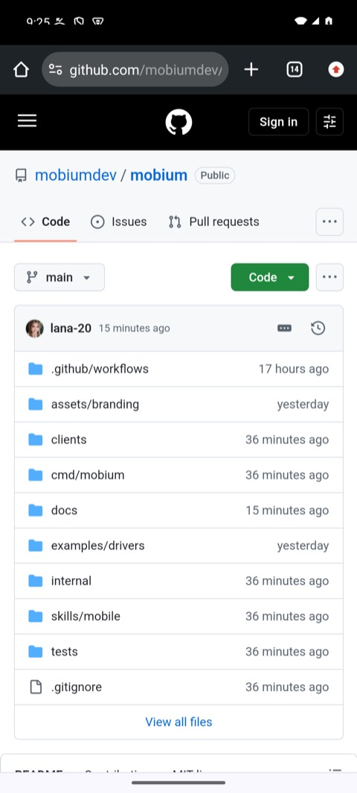

# Network conditions: offline, slow, and back

How an app behaves with no network, or a bad one, is where a lot of its bugs
live, and the one thing a desk never reproduces by itself. `mobium network`
takes an Android device offline, or slows it down, reads back what the device
actually has, and puts it back when the session ends.

Every command, line of output and picture below is what an Android 15
emulator gave on 2026-09-28, except where a phone's or iOS's answer is quoted,
which says so.

## Contents

- [What each device can do](#what-each-device-can-do)
- [1. Where it stands](#1-where-it-stands)
- [2. Offline, and back](#2-offline-and-back)
- [3. A slow network](#3-a-slow-network)
- [4. In a test](#4-in-a-test)
- [Why not the emulator's own throttling](#why-not-the-emulators-own-throttling)
- [The commands](#the-commands)

## What each device can do

| | Offline | Latency and bandwidth |
| --- | --- | --- |
| **Android emulator** | yes | yes |
| **Android phone** | yes | no — shaping traffic needs root, which a phone does not give |
| **iOS simulator or iPhone** | no | no — nothing outside iOS controls its network |

Offline is airplane mode, which any Android device takes. Latency and
bandwidth shape the device's own traffic with Linux's traffic control, which
an emulator's Google APIs image lets run as root and a phone does not. What
a phone says when asked, quoted from a Pixel 8 Pro:

```
$ mobium network --latency 300
error: latency and bandwidth are set by shaping the device's traffic, which needs root, and this device does not give it — a phone's user build has no su. Offline works here; for latency and bandwidth, use an emulator
```

## 1. Where it stands

With no flags, `mobium network` reads the device:

```
$ mobium network
online; no shaping
```

## 2. Offline, and back

```
$ mobium network --offline
offline (airplane mode)

$ mobium open https://github.com/mobiumdev/mobium
opened https://github.com/mobiumdev/mobium

$ mobium network --online
online; no shaping

$ mobium open https://github.com/mobiumdev/mobium
opened https://github.com/mobiumdev/mobium
```

| Offline: airplane mode in the status bar, and no page | Back online: Wi-Fi, and the page |
| --- | --- |
|  |  |

`--offline` answers only once the device has no network, and `--online` only
once it has one again. Airplane mode is the switch; the network is the
outcome, and it is the outcome that is waited for and read back — a device
with Wi-Fi set to stay on in airplane mode is still online with the switch
on, and is reported that way rather than as offline.

On a phone with wireless debugging on, the network coming back can raise
"Allow wireless debugging on this network?" — a question for the phone's
owner. Mobium leaves it for them.

## 3. A slow network

`--latency` adds milliseconds to every round trip; `--download` and
`--upload` cap the rates, in kilobits a second. Together they replace any
shaping set before, and one left out is no limit. Measured from outside
Mobium, with a ping from the emulator to the Mac it runs on:

```
$ adb shell ping -c 3 10.0.2.2
rtt min/avg/max/mdev = 0.402/0.812/1.464/0.466 ms

$ mobium network --latency 300 --download 1600 --upload 750
online; 300ms added to each round trip, download 1600 kbit/s, upload 750 kbit/s

$ adb shell ping -c 3 10.0.2.2
rtt min/avg/max/mdev = 300.971/301.393/302.025/0.780 ms

$ mobium network --reset
online; no shaping

$ adb shell ping -c 3 10.0.2.2
rtt min/avg/max/mdev = 0.429/0.733/1.079/0.268 ms
```

The same page as above, six seconds after it was opened on a much worse
link — `--latency 500 --download 64 --upload 64` — its header in, its body
still coming, the bar under the address still moving:


`--json` gives the same answer to code:

```
$ mobium --json network
{
  "airplane": false,
  "changed": false,
  "device": "emulator-5554",
  "download_kbps": 1600,
  "interface": "wlan0",
  "latency_ms": 300,
  "online": true,
  "upload_kbps": 750
}
```

Every value there is read from the device after the change, never echoed
from the request. The download limit is only reported while it is really in
effect: airplane mode removes part of what makes it work, so coming back
online puts it back, and until it has, it is not reported.

## 4. In a test

`app_network` is a step like any other in a [`mobium test`](test-runner.md)
file, and its answer can be expected on:

```json
{
  "app": "dev.mobium.mobiumapp",
  "beforeEach": [
    {"name": "app_network", "arguments": {"reset": true},
     "description": "every test starts online and unshaped, whatever the last one left"}
  ],
  "tests": [
    {
      "name": "the device goes offline, and comes back",
      "steps": [
        {"name": "app_network", "arguments": {"offline": true}},
        {"expect": {"tool": "app_network", "field": "online", "equals": false}},
        {"name": "app_network", "arguments": {"offline": false}},
        {"expect": {"tool": "app_network", "field": "online", "equals": true}}
      ]
    },
    {
      "name": "a slow network is in place while the test runs",
      "steps": [
        {"name": "app_network", "arguments": {"latency_ms": 300, "download_kbps": 1600}},
        {"expect": {"tool": "app_network", "field": "latency_ms", "equals": 300}},
        {"name": "app_tap", "arguments": {"target": "label=Login Demo"}},
        {"name": "app_wait_for", "arguments": {"target": "testid=username"}}
      ]
    }
  ]
}
```

```
$ mobium test
  ok    [android · emulator-5554] offline.test.json › the device goes offline, and comes back (8.4s)
  ok    [android · emulator-5554] offline.test.json › a slow network is in place while the test runs (2.6s)
2 passed (11s)
```

After the run, read from outside Mobium, the emulator had no shaping and
airplane mode off: a test run ends each project's session, and the end of a
session puts the network back as the session found it. The `beforeEach`
reset is still worth having — it keeps one test's network from reaching the
next inside a run.

## Why not the emulator's own throttling

The Android emulator's console has `network speed` and `network delay`, and
they look made for this. They accept a setting and read it back — and change
nothing: on emulator 37.1.11, 2MB at a 1000 kbit/s limit still arrived in
1.1 seconds where 16 were due, and a 500ms delay left a ping at 1ms. So
Mobium does not use them; it shapes the traffic itself, and every figure
above was measured from the traffic, not the setting
([CHALLENGES](../CHALLENGES.md), "Findings that were not defects").

## The commands

| Command | What it does |
| --- | --- |
| `mobium network` | reads what the device has: online or offline, and any shaping |
| `mobium network --offline` | airplane mode on, and waits for the network to go |
| `mobium network --online` | airplane mode off, and waits for the network to come back |
| `mobium network --latency 300` | adds 300ms to every round trip (emulator) |
| `mobium network --download 1600 --upload 750` | caps the rates, in kbit/s (emulator) |
| `mobium network --reset` | no shaping, airplane mode off |

In a client, the same four calls: Python's `network()`, `set_offline()`,
`shape_network()` and `reset_network()`, and their equivalents in
JavaScript, Go, Java and .NET. [`docs/checks/network.sh`](../checks/network.sh)
holds all of it to the traffic on an emulator and to airplane mode on a phone.
