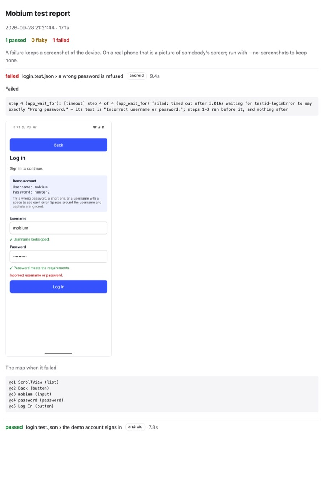
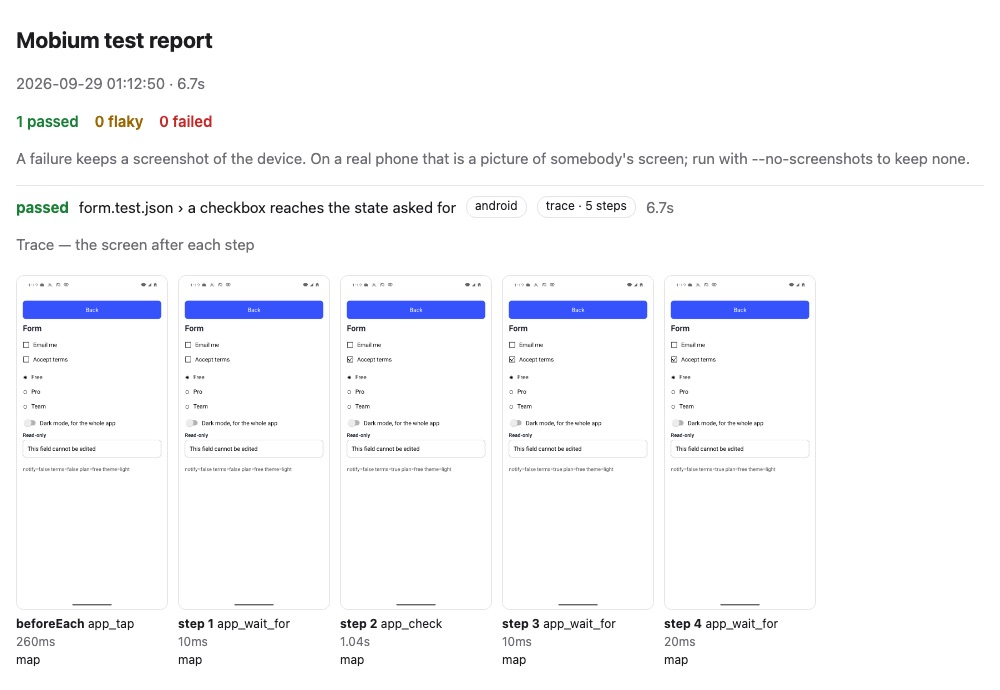

# Quick start: `mobium test`

From an empty directory to a test suite that runs on a device, fails with
evidence, retries, and leaves a report CI can publish.

Every command and every line of output below is what `mobium test` printed on
2026-09-28 — section 8 on 2026-09-29 — against
[MobiumApp](https://github.com/mobiumdev/mobium-app) on an Android 15
emulator. Where a path to a report is shortened, it says so.

Before this guide: [the quick start](../quickstart/README.md) — mobium
installed and a device running — and MobiumApp installed
(`mobiumdev/mobium-app`). Nothing else: the runner is in the `mobium` binary.

## Contents

- [1. A config and a test file](#1-a-config-and-a-test-file)
- [2. Run it](#2-run-it)
- [3. A failure, and what it leaves](#3-a-failure-and-what-it-leaves)
- [4. Run only what failed](#4-run-only-what-failed)
- [5. Retries, and flaky](#5-retries-and-flaky)
- [6. More than one device](#6-more-than-one-device)
- [7. In CI](#7-in-ci)
- [8. Shorter steps, soft checks, a trace and a debugger](#8-shorter-steps-soft-checks-a-trace-and-a-debugger)
- [9. One test over several cases: `each`](#9-one-test-over-several-cases-each)
- [10. A page to run tests from: `--ui`](#10-a-page-to-run-tests-from---ui)
- [Writing tests](#writing-tests)
- [The commands](#the-commands)

## 1. A config and a test file

```
login-tests/
  mobium.config.json
  tests/
    login.test.json
```

`mobium.config.json` says where the tests are and which devices they run on.
A **project** is a device to run on:

```json
{
  "testDir": "tests",
  "projects": [
    {"name": "android", "device": "emulator-5554"}
  ]
}
```

`tests/login.test.json` is two tests of MobiumApp's Login Demo. Each step is
exactly what [`app_batch`](../API.md) takes — a tool and its arguments — and
each assertion is an `app_wait_for` step or an `expect`:

```json
{
  "app": "dev.mobium.mobiumapp",
  "beforeEach": [
    {"name": "app_tap", "arguments": {"target": "label=Login Demo"}}
  ],
  "tests": [
    {
      "name": "a wrong password is refused",
      "steps": [
        {"name": "app_fill", "arguments": {"target": "testid=username", "text": "mobium"}},
        {"name": "app_fill", "arguments": {"target": "testid=password", "text": "wrongpass1"}},
        {"name": "app_tap", "arguments": {"target": "testid=loginBtn"}},
        {"name": "app_wait_for", "arguments": {"target": "testid=loginError", "condition": "text",
          "text": "Incorrect username or password.", "exact": true}}
      ]
    },
    {
      "name": "the demo account signs in",
      "steps": [
        {"name": "app_fill", "arguments": {"target": "testid=username", "text": "mobium"}},
        {"name": "app_fill", "arguments": {"target": "testid=password", "text": "hunter2"}},
        {"name": "app_tap", "arguments": {"target": "testid=loginBtn"}},
        {"name": "app_wait_for", "arguments": {"target": "testid=welcomeText"}},
        {"expect": {"tool": "app_state", "arguments": {"app": "dev.mobium.mobiumapp"},
          "field": "state", "equals": "foreground"}}
      ]
    }
  ]
}
```

Every test starts from a fresh app: `app` is stopped and launched — with
`"grayBox": true` beside it, launched with [the gray box](graybox.md) on —
then
`beforeEach` runs, then the test's steps. The file is checked before anything
runs — a misspelled tool, an argument its tool does not take, a key the
format does not have — and `--list` shows what a run would cover without a
device:

```
$ mobium test --list
  login.test.json › a wrong password is refused
  login.test.json › the demo account signs in
2 tests in 1 file
```

## 2. Run it

From the directory with the config:

```
$ mobium test
  ok    [android] login.test.json › a wrong password is refused (7.7s)
  ok    [android] login.test.json › the demo account signs in (7.8s)
2 passed (15.5s)
```

Exit status 0. Nothing in the test sleeps: every action waits for its own
target ([auto-wait](autowait.md)), and every assertion retries until it holds
or its timeout — ten seconds unless the step says otherwise.

## 3. A failure, and what it leaves

Change the first test to expect a message the app never shows — `"text":
"Wrong password."`, with `"timeout_ms": 3000` — and run just that test, with
all three reports:

```
$ mobium test -g "wrong password" --reporter list,junit,html
  FAIL  [android] login.test.json › a wrong password is refused (9.5s)
        step 4 (app_wait_for): [timeout] step 4 of 4 (app_wait_for) failed: timed out after 3.012s waiting for testid=loginError to say exactly "Wrong password." — its text is "Incorrect username or password."; steps 1-3 ran before it, and nothing after
0 passed, 1 failed (9.5s)
junit report: …/login-tests/mobium-report/junit.xml
html report: …/login-tests/mobium-report/index.html
error: 1 of 1 tests failed
```

(The report paths are shortened here.) Exit status 1. The failure names the
step, its error code, and what the screen said instead of what was expected.
`mobium show-report` opens the HTML report, which keeps, for each failure, a
screenshot and the screen's map at the moment it failed:

```
mobium-report/
  index.html
  junit.xml
  artifacts/
    android-login.test.json-a-wrong-password-is-refused-1.png
```

The report, with that failure open — the step and its message, the screen
as it was when the wait gave up, with the app's real message on it, and the
map:



(This picture is of a run of both tests, the other one passing.) On a real
phone that screenshot is a picture of somebody's screen, and the report says
so; `--no-screenshots` keeps none. A report names a real phone by its model,
`[iphone · iPhone 15 Plus]`, and never by its id.

## 4. Run only what failed

```
$ mobium test --last-failed
  FAIL  [android] login.test.json › a wrong password is refused (8.7s)
        step 4 (app_wait_for): [timeout] step 4 of 4 (app_wait_for) failed: timed out after 3.018s waiting for testid=loginError to say exactly "Wrong password." — its text is "Incorrect username or password."; steps 1-3 ran before it, and nothing after
0 passed, 1 failed (8.7s)
error: 1 of 1 tests failed
```

The previous run's failures are kept in `mobium-report/.last-run.json`.

## 5. Retries, and flaky

`--retries N` runs a failed test again, from a fresh app, up to N times. A
test that fails and then passes is **flaky**: the run passes, and it says so.
This is the runner's own control for it, from `tests/controls/` in this
repository — it saves a counter, and passes only once the counter reaches 2,
which the retry's relaunch makes it do. It counts from cleared app data, so
clear it first — a counter left at 2 by an earlier run fails every attempt:

```
$ mobium clear-data dev.mobium.mobiumapp
$ mobium test tests/controls/flaky.test.json --retries 1
  flaky [android] flaky.test.json › passes on its second attempt (7.3s) — passed on attempt 2
0 passed, 1 flaky (7.3s)
```

Exit status 0. In JUnit, a flaky test is a pass with a `flaky` property, and
in the HTML report it opens on the failure it had first.

### A device that drops off and comes back

A retry starts the test over. A device whose link drops for a few seconds —
a TV or a phone over Wi-Fi — is waited out within the test instead: a step
whose call **never reached the device** is made again once it is back, for
up to 90 seconds and never past the test's own time. A device reached by
`adb connect` is connected again for you. Only that failure is waited out,
and an error says which it was (`details.reached` is `false`): the device
lookup failed, or a session could not start, so nothing was sent. A failure
from inside a call that may have reached the device — a press sent as the
link went — fails the step as before, because making it again could press
twice. A batch of steps goes on from the one that did not reach the device.

Measured on a Fire TV whose link adb marked offline several times a minute:
a 20-step test that failed every attempt before passed on its first, through
two disconnects made on purpose during it, with its trace intact.

## 6. More than one device

Add a project per device. An iOS simulator's id is one Mac's, and a phone's is
somebody's, so a project can take its device from the environment, and an
unset variable is refused by name before any test runs:

```json
{
  "testDir": "tests",
  "projects": [
    {"name": "android", "device": "emulator-5554"},
    {"name": "ios", "device": "${MOBIUM_IOS_DEVICE}", "driver": "wda"}
  ]
}
```

```sh
MOBIUM_IOS_DEVICE=<simulator-udid> mobium test          # both, at once
mobium test --project android                           # one
```

Projects run at once, one worker to a device — a device holds one session,
so two workers never share one — and `--workers 1` runs them one after
another. On a grid, a project can name a `platform` instead of a device,
and each project leases its own for the run: [the grid guide](grid.md#4-tests-on-a-grid). Each project also gets a daemon of its own for the run, so projects on
different devices never queue behind one another: this repository's suite,
[tests/](../../tests/README.md), ran its tests — 14 of them then; 9 now,
18 over its two projects — on two Android emulators in 40 seconds, for 75
seconds of work. When the run ends, each project's
session ends, and the end of a session puts back whatever the tests changed —
the network, accessibility settings.

## 7. In CI

The command a CI job runs, and what it publishes:

```sh
mobium test --reporter list,junit,html
# junit:  mobium-report/junit.xml   — for the CI's test report
# html:   mobium-report/            — as a build artifact
```

The exit status is 0 when every test passed or was flaky, 1 when any failed,
and one of mobium's own codes when the run could not start — 2 for a bad file
or an unset device, 3 for no device — so a job can tell "the app is broken"
from "the run is". The JUnit file has been read by Python's XML parser in
[`docs/checks/test-runner.sh`](../checks/test-runner.sh), counts matching.
A CI job also needs a device running before the tests start; for Android on a
Linux runner, [SETUP.md](../SETUP.md#on-linux) has the emulator's steps.

## 8. Shorter steps, soft checks, a trace and a debugger

### The step shorthand

A step can be one key — a tool's name without `app_` — whose value is the
tool's main argument, or an object of its arguments. The Form Demo's tests in
this repository are written that way:

```json
{
  "app": "dev.mobium.mobiumapp",
  "beforeEach": [
    {"tap": "label=Form Demo"}
  ],
  "tests": [
    {"name": "a checkbox reaches the state asked for", "steps": [
      {"wait_for": {"target": "testid=termsCheck", "condition": "unchecked"}},
      {"check": "testid=termsCheck"},
      {"wait_for": {"target": "testid=termsCheck", "condition": "checked"}},
      {"wait_for": {"target": "testid=notifyCheck", "condition": "checked", "not": true}}
    ]}
  ]
}
```

```
$ mobium test mobiumapp/form.test.json --project android
  ok    [android · emulator-5554] form.test.json › a checkbox reaches the state asked for (4.4s)
  ok    [android · emulator-5554] form.test.json › choosing a radio clears the one before (3.4s)
  ok    [android · emulator-5554] form.test.json › the dark mode switch goes on and back off (4.8s)
3 passed (12.7s)
```

A string goes to `target` when the tool has one, else to its one required
string (`{"launch": "dev.mobium.mobiumapp"}`, `{"find": "role=button"}`),
else to its only argument. A tool with no one main argument says so and asks
for them named: `{"swipe": "up"}` is refused, `{"swipe": {"direction":
"up"}}` is not. The shorthand is read into the long form and checked as the
long form is, so the two mix freely, and a step keeps its `description`
beside either.

### Soft assertions

`"soft": true` on a `wait_for` or an `expect` records its failure and goes
on, so one run reports every check that failed — the test still fails.
[tests/controls/soft.test.json](../../tests/controls/soft.test.json) holds two
that cannot hold, around steps that must still run:

```
$ mobium test controls/soft.test.json --project android
  FAIL  [android · emulator-5554] soft.test.json › two soft failures, and the test carries on (7.3s)
        soft, carried on: terms start unchecked, so this cannot hold — step 2 (app_wait_for): [timeout] timed out after 1.523s waiting for testid=termsCheck to become checked — it is unchecked
        soft, carried on: the app is in front, so this cannot hold — step 4 (expect app_state): [timeout] expected app_state's state to be "background", and after 1.5s state is "foreground"
0 passed, 1 failed (7.3s)
error: 1 of 1 tests failed
```

Each soft failure keeps its own screenshot and map. Only an assertion can be
soft: an action that failed leaves nothing after it worth checking, and a
soft `tap` is refused before anything runs.

### A trace

`--trace on` keeps a screenshot and the map after every step, and the HTML
report shows them as a filmstrip; `--trace retain-on-failure` keeps them only
for a test that failed. `trace` in the config sets the default. Each
attempt is also kept as a recording in Vibium's record format, at
`mobium-report/artifacts/trace/<project>-<file>-<test>-<attempt>/trace.zip`,
which the report links and [player.vibium.dev](https://player.vibium.dev)
opens.

```
$ mobium test mobiumapp/form.test.json -g checkbox --project android --trace on --reporter list,html
  ok    [android · emulator-5554] form.test.json › a checkbox reaches the state asked for (6.7s)
1 passed (6.7s)
html report: …/tests/mobium-report/index.html
```



(The report's path is shortened, and the test opened.) A traced run takes its
steps one at a time, where an untraced one batches them, and waits for the
screen to stop changing before each frame — so it is slower, and off by
default. With `--no-screenshots` a trace keeps the maps and no picture, which
is the setting for somebody's phone.

### Stepping through a test

`--debug` stops before every step, prints it and the screen, and waits:
Enter runs the step, `m` maps again, `c` runs the rest of the test, `q`
quits. One project at a time, and the test's timeout is off while you read.

```
$ mobium test mobiumapp/form.test.json -g checkbox --project android --debug

[android] form.test.json › a checkbox reaches the state asked for — beforeEach
  {"arguments":{"target":"label=Form Demo"},"name":"app_tap"}

@e1 homeList (list)
@e2 WebViews (button)
@e3 Login Demo (button)
…
@e13 Dialog Demo (button)

Enter runs it · m maps again · c runs the rest of the test · q quits >
[android] form.test.json › a checkbox reaches the state asked for — step 1
  {"arguments":{"condition":"unchecked","target":"testid=termsCheck"},"name":"app_wait_for"}

@e1 Back (button)
@e2 Email me (checkbox, unchecked)
@e3 Accept terms (checkbox, unchecked)
…
```

(Maps trimmed.) The step is printed in the long form, whichever form the file
used. Quitting reports the test `stopped` and runs nothing after it; closed
input — a pipe that ends — runs the rest rather than wait.

## 9. One test over several cases: `each`

A test with `"each"` runs once per case, as a test of its own. `${key}` in
any string of its steps is that case's value; a string that is nothing but
`${key}` keeps the value's type, so a count stays a number. `$${` writes a
literal `${`.

```json
{"name": "a bad sign-in is refused, and says why: ${why}",
 "each": [
   {"why": "a wrong password", "pass": "wrongpass1", "error": "loginError"},
   {"why": "a short password", "pass": "abc", "error": "passError"}
 ],
 "steps": [
   {"fill": {"target": "testid=password", "text": "${pass}"}},
   {"tap": "testid=loginBtn"},
   {"wait_for": {"target": "testid=${error}", "condition": "visible"}}
 ]}
```

With a `${key}` in its name, each case is named by it; without one, the
cases are numbered — `[1]`, `[2]` — rather than named after values that may
be a password. A key a case does not have is refused when the file is read,
before anything runs.

## 10. A page to run tests from: `--ui`

```sh
mobium test --ui --open
```

serves a page on this machine that lists the suite by file, with each test's
result on each project. ▶ runs one test, a file, or everything; each step
appears with the screen after it as it runs, and **Re-run failed** runs
exactly what failed. The files are read again for every run, so a test you
just saved is the test that runs. A run from the page is the run `mobium
test` makes from the same config and flags, and writes the same reports. The
page answers only its own address with the token it prints, as `mobium
inspect`'s does.

## Writing tests

- **Find targets with `map` first.** `mobium map` on the screen you are
  testing gives each element's locator; `testid=` is the one that survives a
  translation and a redesign.
- **Assert with `app_wait_for`**, never a sleep. `--for` in the CLI is
  `condition` in a step: `visible`, `hidden`, `text` (with `exact`), `value`,
  `enabled`, `disabled`, `checked`, `unchecked`, `focused`, `count`, and
  `"not": true` for the opposite. The [auto-wait guide](autowait.md#5-waiting-on-purpose-mobium-wait)
  has the table.
- **Assert on anything else with `expect`**: a tool that only reads, a field
  of its answer, and the value — `app_state`'s `state`, `app_network`'s
  `online`, `app_accessibility`'s `settings.bold_text`. A call that changes
  something is refused, because an `expect` repeats its call until it
  matches.
- **Answer the dialogs a platform raises** with a rule in `beforeEach`:
  `{"name": "app_dialogs", "arguments": {"when": "Save Password", "press":
  "Not Now"}}` answers iOS's offer to save a password, and never fires on
  Android, where it never comes.
- **Keep platform differences out of the steps.** Pressing enter in
  MobiumApp's password field submits the form on iOS and not on Android; a
  test that pressed it signed in twice on one platform. Tap the button.
- **A test is a unit.** Tests in a file run in order on one device, but each
  starts from a fresh app, so none may depend on another.

## The commands

| Command | What it does |
| --- | --- |
| `mobium test` | runs every `*.test.json` under the config's `testDir`, on every project |
| `mobium test tests/login.test.json` | runs one file, or every file under a directory |
| `mobium test -g login` | runs the tests whose title — "file › name" — matches a regular expression |
| `mobium test --last-failed` | runs only the tests that failed last time |
| `mobium test --project android` | runs on the named projects only |
| `mobium test --workers 4` | how many devices run at once — at most one per device |
| `mobium test --retries 2` | runs a failed test again, up to twice; a pass after a failure is flaky; `retries` in the config sets the default |
| `mobium test --timeout 30s` | the time for each test; `timeout` in the config is milliseconds |
| `mobium test --reporter list,json,junit,html` | which reports to write, comma-separated |
| `mobium test --config ci.config.json` | uses this config, not `mobium.config.json` here or above |
| `mobium test --output out` | where reports go; `mobium-report` beside the config by default, `outputDir` in the config |
| `mobium test --list` | lists the tests a run would cover, and runs nothing |
| `mobium test --no-screenshots` | keeps no screenshot of a failure, and a trace keeps only the maps |
| `mobium test --trace on` | a screenshot and the map after every step, and the test as a recording in Vibium's record format that player.vibium.dev opens; `retain-on-failure` keeps a failed test's only |
| `mobium test --debug` | stops before each step: Enter steps, `m` maps again, `c` continues, `q` quits |
| `mobium test --ui` | serves a page to pick, run and watch tests (`--open`, `--ui-port`) |
| `mobium show-report` | opens the last HTML report |

Recording a test from what you do is [`mobium inspect`](inspector.md): what
you do on its page is kept as steps, and downloads as a `*.test.json`.
