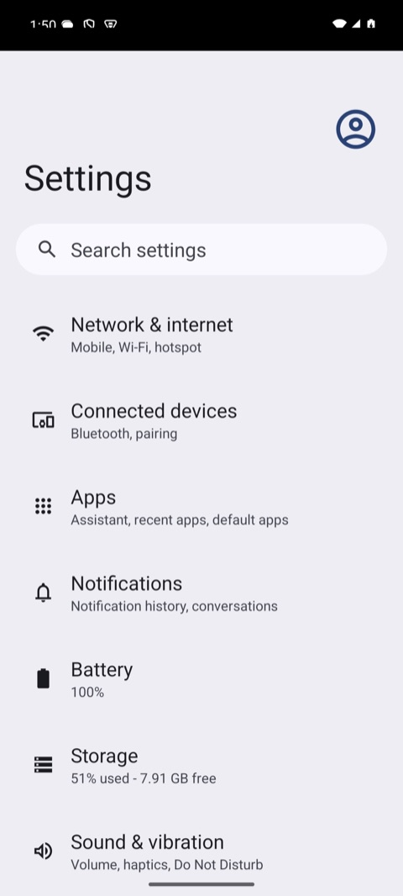
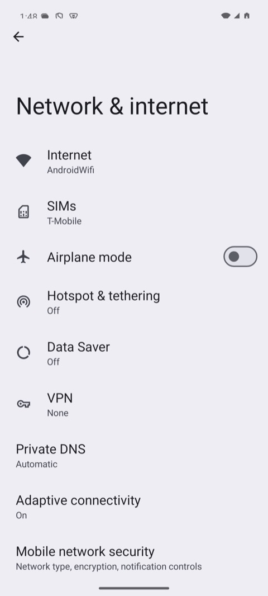
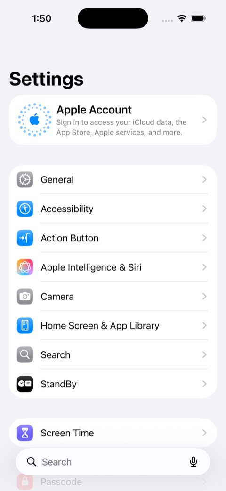
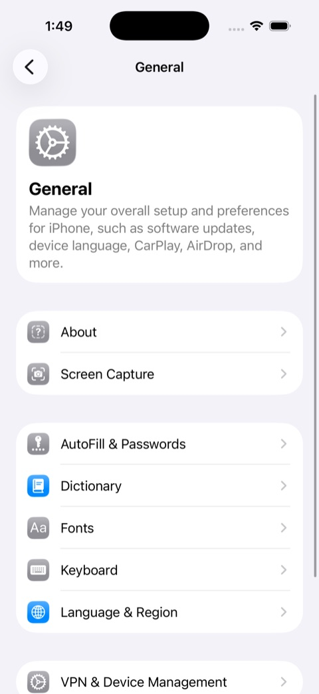

# Quick start: Java

<!-- Generated by docs/quickstart/build.py from examples/ and output/. Edit those, then run `make quickstart`. -->

Start a session on a device, launch Settings, tap a row, take a screenshot, and quit — from Java. Starts with `Mobium.builder().platform(...).app(...).start()`; ends with `device.quit()`, or leaving try-with-resources.

Before this page: [install mobium and prepare a device](README.md).

## 1. What you need

Java 17 or later.

## 2. Install the client

Not on Maven Central yet. Until the first release it installs into your local Maven repository from a clone; after it, the dependency below resolves from Central with no clone at all.

```sh
git clone https://github.com/mobiumdev/mobium.git ~/mobium
cd ~/mobium/clients/java && ./mvnw install -DskipTests && cd -
mkdir quickstart && cd quickstart
```

## 3. The code

Save this as `Quickstart.java` in the project folder — it is [examples/java/Quickstart.java](examples/java/Quickstart.java).

```java
import dev.mobium.Element;
import dev.mobium.Mobium;
import dev.mobium.Session;

import java.nio.file.Path;
import java.util.List;
import java.util.Map;

/**
 * Mobium quick start: start a session, drive Settings, quit.
 *
 * <pre>MOBIUM_PLATFORM=android java Quickstart.java    # or ios</pre>
 */
public class Quickstart {

    // Settings is on every emulator, simulator and phone, with nothing to install.
    record Target(String app, String row, String next) {}

    static final Map<String, Target> PLATFORMS = Map.of(
            "android", new Target("com.android.settings", "Network & internet", "text=Airplane mode"),
            "ios", new Target("com.apple.Preferences", "General", "label=About,role=button"));

    public static void main(String[] args) {
        String platform = System.getenv().getOrDefault("MOBIUM_PLATFORM", "android");
        Target p = PLATFORMS.get(platform);

        Mobium.Builder b = Mobium.builder().platform(platform).app(p.app());
        String serial = System.getenv("MOBIUM_DEVICE");
        if (serial != null) b.device(serial);

        // 1. Start the session: the driver is started on the device and
        //    Settings is launched. try-with-resources quits when it ends.
        try (Mobium device = b.start()) {
            Session s = device.session();
            System.out.printf("session on %s (%s, %s)%n", s.device(), s.platform(), s.driver());

            // 2. Map the screen: every element you can act on, each with a @ref.
            List<Element> elements = device.map();
            elements.stream().limit(5).forEach(e -> System.out.println("  " + e));

            // 3. Tap a row by its ref, then wait for the screen it opens. A row's
            //    label can carry its summary too ("Network & internet Mobile,
            //    Wi-Fi, ..."), so match its start.
            Element row = elements.stream().filter(e -> e.label().startsWith(p.row())).findFirst().orElseThrow();
            device.tap(row.ref());
            device.waitFor(p.next());
            System.out.println("opened " + p.row());

            // 4. Take a screenshot.
            device.screenshot(Path.of("quickstart-" + platform + ".png"));
            System.out.println("saved quickstart-" + platform + ".png");
        }
        // 5. try-with-resources has quit: the device's session is closed.
        System.out.println("session ended");
    }
}
```

Settings is on every Android and iOS device with nothing to install. The row and the screen after it are the only things that differ by platform.

## 4. Run it

### Android

```sh
MOBIUM_PLATFORM=android java -cp ~/.m2/repository/dev/mobium/mobium/0.1.0-SNAPSHOT/mobium-0.1.0-SNAPSHOT.jar Quickstart.java
```

What it printed on an Android 15 emulator:

```
waiting for the UiAutomator2 server to start...
session on emulator-5554 (android, uiautomator2)
  @e1 settings_homepage_container (list)
  @e2 Profile picture, double tap to open Google Account (button)
  @e3 Search settings (button)
  @e4 main_content_scrollable_container (list)
  @e5 Network & internet Mobile, Wi‑Fi, hotspot (button)
opened Network & internet
saved quickstart-android.png
session ended
```

| After start | After the tap |
| --- | --- |
|  |  |

### iOS

```sh
MOBIUM_PLATFORM=ios java -cp ~/.m2/repository/dev/mobium/mobium/0.1.0-SNAPSHOT/mobium-0.1.0-SNAPSHOT.jar Quickstart.java
```

What it printed on an iOS 26.5 simulator:

```
waiting for WebDriverAgent to start...
session on 457C7DC2-C706-45D9-8D68-1D26953E28B1 (ios, wda)
  @e1 Apple Account, Sign in to access your iCloud data, the App Store, Apple services, and more. (button)
  @e2 General (button)
  @e3 Accessibility (button)
  @e4 Action Button (button)
  @e5 Apple Intelligence & Siri (button)
opened General
saved quickstart-ios.png
session ended
```

| After start | After the tap |
| --- | --- |
|  |  |

The first start on a device is slow: it installs the UiAutomator2 server on Android, and on a real iPhone builds WebDriverAgent. Later starts take seconds.

## Notes

- `./mvnw install` puts the jar in your local Maven repository. In a Maven project, depend on it with:

  ```xml
  <dependency>
    <groupId>dev.mobium</groupId>
    <artifactId>mobium</artifactId>
    <version>0.1.0-SNAPSHOT</version>
  </dependency>
  ```

  That is the scope this example runs with, from `src/main/java`; in a test suite, add `<scope>test</scope>` (Gradle: `testImplementation`).

  In Gradle — verified with Gradle 9.8, running this example on both platforms — `build.gradle.kts`:

  ```kotlin
  plugins { application }

  repositories {
      mavenLocal()     // until dev.mobium:mobium is on Maven Central
      mavenCentral()
  }

  dependencies { implementation("dev.mobium:mobium:0.1.0-SNAPSHOT") }

  application { mainClass = "Quickstart" }
  ```

  with `Quickstart.java` in `src/main/java/`, then `gradle run`.
- try-with-resources around `start()` quits when it ends. Around `connect()` it only closes the connection, leaving the session open.
- With more than one device of the session's platform running — two Android devices, or two among the booted simulators and attached iPhones — `start` refuses to guess and lists them. One Android device and one iOS device are not ambiguous: the platform picks. Name one with `MOBIUM_DEVICE=<serial or UDID>`, which the example passes on as the device.

Next: [the rest of the tool surface](../API.md), and [setting up phones and simulators](../SETUP.md). Changing the client itself? [DEVELOPMENT.md](../DEVELOPMENT.md) is the contributor's guide.
